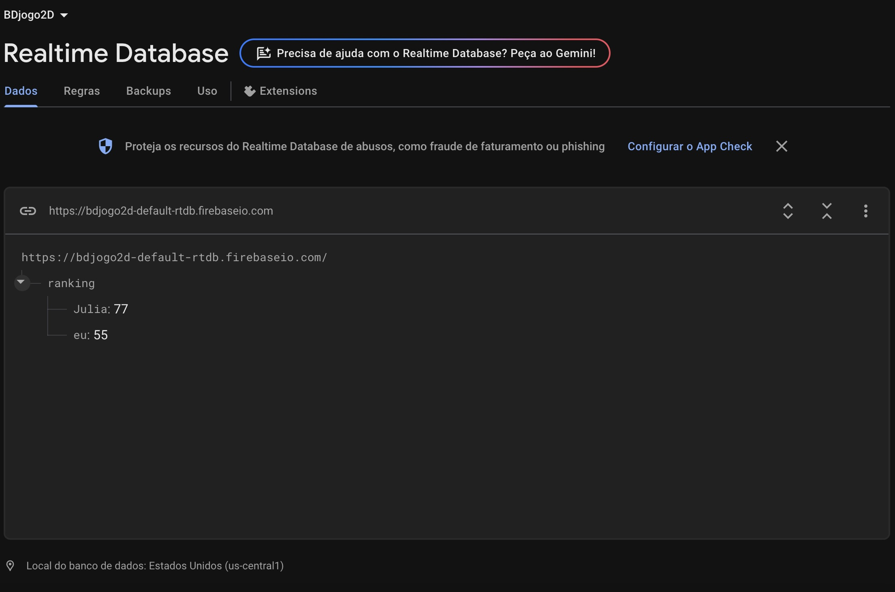

from pathlib import Path

# Conteúdo do README.md
readme_content = """
# 🐔 A Fuga da Galinha

## 🎮 Descrição do Jogo
*A Fuga da Galinha* é um jogo onde você controla uma galinha tentando escapar de lobos. Durante a fuga, a galinha pode coletar **milhos** e **ovos dourados** que aparecem aleatoriamente para ganhar pontos. Durante a jogatina, **raposas** começam a surgir, tornando o desafio ainda maior!

## 🕹️ Como Jogar

- **Mova a galinha** com as teclas de seta do teclado;
- **Elimine lobos** apertando o botão esquerdo do mouse e atirando ovos neles;
- **Colete milhos** para ganhar +3 pontos;
- **Colete ovos dourados** para ganhar +10 pontos;
- O objetivo é **sobreviver o máximo possível e somar pontos**;
- **Ranking** no final do jogo: adicione seu nome/nickname para participar!

## ✨ Funcionalidades

- Pontos de vida para inimigos que diminuem quando os ovos os atingem;
- Quando os pontos de vida são zerados, o inimigo desaparece;
- Spawn aleatório de milhos e ovos dourados;
- Sistema de pontuação com feedback visual;
- Aparição de lobos e raposas conforme os segundos passam;
- Botão para reiniciar de jogo.

## 🔁 Como Reiniciar o Jogo

Clique no botão **"RESTART"** disponível na tela de game over para começar novamente. Ele reinicia o layout e zera a pontuação.

## 🌐 Acesse o Jogo Online

👉 [Clique aqui para jogar A Fuga da Galinha](https://afugadagalinha.tiiny.site/)

## 🖼️ Prints da Aplicação

## 🗄️ Prints do Banco de Dados

*(Se você usa um banco para o ranking, adicione o print aqui)*  

## 🎨 Sprites Utilizadas

- 🔠
- 🺠.png)
- 🦊 
- 🌽 
- 🥚 
     
     

## 📋 Requisitos

- Criado com [Construct](https://editor.construct.net/).
- Compatível com a versão gratuita (até 25 eventos).

## 👩‍💻 Desenvolvido por

**Júlia Moreira**  
Projeto desenvolvido para fins educacionais.
"""

# Caminho do arquivo
readme_path = Path("README.md")

# Salvar o arquivo
readme_path.write_text(readme_content, encoding="utf-8")
